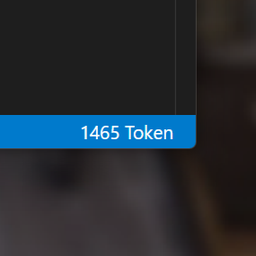

# 🚀 GPT-3 Token Counter Statusbar 🎉

🌟 A Visual Studio Code extension that displays the count of
OpenAI GPT-3 tokens for the current document in the status bar.
🎯

## 📚 Description

The `vscode-openai-token-display` extension allows you to monitor the count of OpenAI tokens for the current document right in the status bar of Visual Studio Code. 🔍 This information is useful when you want to check the token count in your code for use with OpenAI services, such as GPT-3 or Codex.

## 🛠️ Installation

1. Open Visual Studio Code
2. Press <kbd>Ctrl</kbd>+<kbd>P</kbd> (Windows/Linux) or <kbd>Cmd</kbd>+<kbd>P</kbd> (Mac) to open the Quick Open bar.
3. Type `ext install vscode-openai-token-display` and press enter.

## 📖 Usage

To use the command, you can:

1. Press <kbd>Ctrl</kbd>+<kbd>Shift</kbd>+<kbd>P</kbd> (Windows/Linux) or <kbd>Cmd</kbd>+<kbd>Shift</kbd>+<kbd>P</kbd> (Mac) to open the Command Palette.
1. Type `Toggle OpenAI Token Display` and press <kbd>enter</kbd> .

## 👥 Contributing

Contributions are always welcome! Feel free to open a pull request, report a bug, or suggest a new feature.

by Martin Hausleitner + GPT-4
